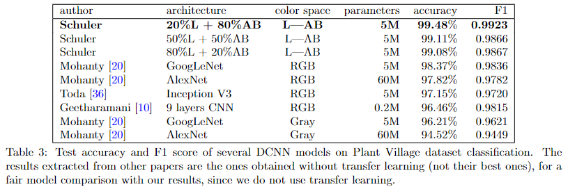
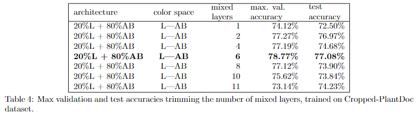
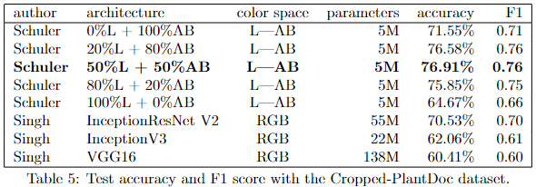

# Color-aware two-branch DCNN for efficient plant disease classification
This repository contains the source code for the paper [Color-aware two-branch DCNN for efficient plant disease classification](https://www.researchgate.net/publication/361511874_Color-Aware_Two-Branch_DCNN_for_Efficient_Plant_Disease_Classification) by Joao Paulo Schwarz Schuler, Santiago Romani, Mohamed Abdel-Nasser, Hatem Rashwan and Domenec Puig.

## Abstract
Deep convolutional neural networks (DCNNs) have been successfully applied to plant disease detection. Unlike most existing studies, we propose feeding a DCNN CIE Lab instead of RGB color coordinates. We modified an Inception V3 architecture to include one branch specific for achromatic data (L channel) and another branch specific for chromatic data (AB channels). This modification takes advantage of the decoupling of chromatic and achromatic information. Besides, splitting branches reduces the number of trainable parameters and computation load by up to 50\% of the original figures using modified layers. We achieved a state-of-the-art classification accuracy of 99.48\% on the Plant Village dataset and 76.91\% on the Cropped-PlantDoc dataset.

## The Raw Experiment Files
The source code for the experiments described in the paper can be found at the raw folder:
* [Plant Village with baseline model](https://github.com/joaopauloschuler/two-branch-plant-disease/tree/main/raw/baseline-plant-village).
* [Plant Village with L+AB branches model](https://github.com/joaopauloschuler/two-branch-plant-disease/tree/main/raw/two-paths-plant-village).
* [Cropped-PlantDoc with L+AB branches model](https://github.com/joaopauloschuler/two-branch-plant-disease/tree/main/raw/two-paths-cropped-plant-doc).

## Results
Raw notebook files with source code for tables [3](https://github.com/joaopauloschuler/two-branch-plant-disease/blob/main/raw/two-paths-plant-village/two_path_inception.ipynb), [4](https://github.com/joaopauloschuler/two-branch-plant-disease/blob/main/raw/two-paths-cropped-plant-doc/Cropped-PlantDoc-Mixed-Layer-Search-Table-4.ipynb) and [5](https://github.com/joaopauloschuler/two-branch-plant-disease/blob/main/raw/two-paths-cropped-plant-doc/Cropped-PlantDoc-LAB-Filter-Search-Table-5.ipynb) are available.
<p align="center"></img></p>
<p align="center"></img></p>
<p align="center"></img></p>

## Further Reading
You may be interested in our other paper about [making plant disease classification noise resistant](https://github.com/joaopauloschuler/two-path-noise-lab-plant-disease).

## Citing this Paper
```
@article{Schuler_2022_2branches,
  title={Color-Aware Two-Branch DCNN for Efficient Plant Disease Classification}, 
  volume={28}, 
  url={https://mendel-journal.org/index.php/mendel/article/view/176},
  number={1},
  journal={MENDEL},
  author={Schwarz Schuler, Joao Paulo and Romani, Santiago and Abdel-Nasser, Mohamed and Rashwan, Hatem and Puig, Domenec},
  year={2022},
  month={Jun.},
  pages={55-62}
}
```
